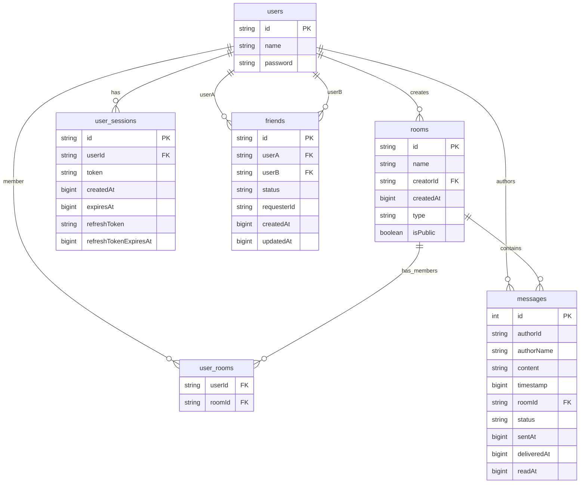

# Database Schema, Relations, and Indexing

This document describes the relational schema used by the Express server and explains how the defined indexes improve performance and contribute to safety. The source of truth for table definitions is `server/Express/infrastructure/migrations/initializeSchema.ts`.

> Dialects supported: SQLite, MariaDB/MySQL. Minor differences: types (`TEXT` vs `VARCHAR`, `INTEGER` vs `BIGINT`), auto-increment strategy for `messages.id`, and the presence of a unique index for `refreshToken` in SQLite.

## Tables

### users
- Columns
  - `id` (TEXT/VARCHAR, PK)
  - `name` (TEXT/VARCHAR, NOT NULL)
  - `password` (TEXT/VARCHAR, NOT NULL)
- Purpose: User account identity and credentials.

### rooms
- Columns
  - `id` (TEXT/VARCHAR, PK)
  - `name` (TEXT/VARCHAR, NOT NULL)
  - `creatorId` (TEXT/VARCHAR, NOT NULL) → FK to `users(id)`
  - `createdAt` (INTEGER/BIGINT, NOT NULL)
  - `type` (TEXT/VARCHAR, DEFAULT `'room'`)
  - `isPublic` (INTEGER/TINYINT, DEFAULT `1`)
- Purpose: Chat rooms or user-to-user conversation containers.

### user_rooms (join table)
- Columns
  - `userId` (TEXT/VARCHAR, NOT NULL) → FK to `users(id)`
  - `roomId` (TEXT/VARCHAR, NOT NULL) → FK to `rooms(id)`
  - Composite PK `(userId, roomId)`
- Purpose: Many-to-many membership between users and rooms.

### messages
- Columns
  - `id` (INTEGER AUTOINCREMENT / BIGINT AUTO_INCREMENT, PK)
  - `authorId` (TEXT/VARCHAR)
  - `authorName` (TEXT/VARCHAR)
  - `content` (TEXT)
  - `timestamp` (INTEGER/BIGINT)
  - `roomId` (TEXT/VARCHAR, NOT NULL) → FK to `rooms(id)`
  - `status` (TEXT/VARCHAR, DEFAULT `'sent'`)
  - `sentAt` (INTEGER/BIGINT)
  - `deliveredAt` (INTEGER/BIGINT)
  - `readAt` (INTEGER/BIGINT)
- Purpose: Messages posted to rooms. `authorId` is stored denormalized (not enforced FK) for performance and historical consistency.

### user_sessions
- Columns
  - `id` (TEXT/VARCHAR, PK)
  - `userId` (TEXT/VARCHAR, NOT NULL) → FK to `users(id)`
  - `token` (TEXT/VARCHAR, NOT NULL)
  - `createdAt` (INTEGER/BIGINT, NOT NULL)
  - `expiresAt` (INTEGER/BIGINT, NULLABLE)
  - `refreshToken` (TEXT/VARCHAR, NULLABLE)
  - `refreshTokenExpiresAt` (INTEGER/BIGINT, NULLABLE)
- Purpose: Authentication sessions (per device/browser).

### friends
- Columns
  - `id` (TEXT/VARCHAR, PK)
  - `userA` (TEXT/VARCHAR, NOT NULL) → FK to `users(id)`
  - `userB` (TEXT/VARCHAR, NOT NULL) → FK to `users(id)`
  - `status` (TEXT/VARCHAR, NOT NULL) — `'pending' | 'accepted'`
  - `requesterId` (TEXT/VARCHAR, NOT NULL) → who initiated the request
  - `createdAt` (INTEGER/BIGINT, NOT NULL)
  - `updatedAt` (INTEGER/BIGINT, NOT NULL)
  - Unique constraint: `(userA, userB)`
- Purpose: Friendship edges with status and audit fields.

## Relationships
- `users (1) -> (N) rooms` via `rooms.creatorId`.
- `users (M) <-> (N) rooms` via `user_rooms(userId, roomId)`.
- `rooms (1) -> (N) messages` via `messages.roomId`.
- `users (1) -> (N) user_sessions` via `user_sessions.userId`.
- `users (N) <-> (N) users` via `friends(userA, userB)`.

Note: `messages.authorId` is a logical link to `users(id)` but not an enforced FK. This keeps writes fast and allows historical messages to survive user deletions or name changes while preserving `authorName`.

## Indexes and Their Effects

The migration defines the following indexes (dialect differences noted inline):

### user_sessions
- Unique: `uniq_user_sessions_token (token)`
- SQLite-only Unique: `uniq_user_sessions_refresh (refreshToken)`
- Non-unique: `idx_user_sessions_userId (userId)`
- Benefits
  - Security: Unique `token` prevents duplicates; simplifies O(1) token lookups and reliably identifies a single session.
  - Performance: `userId` index speeds queries like “list sessions for user” and cascade-like cleanup.

### friends
- Indexes
  - `idx_friends_userA (userA)`
  - `idx_friends_userB (userB)`
  - Composite: `idx_friends_userA_status (userA, status)`
  - Composite: `idx_friends_userB_status (userB, status)`
- Benefits
  - Performance: Efficiently filters pending/accepted requests for a user in O(log N) rather than full scans.
  - Safety: Combined with unique `(userA, userB)` constraint, prevents duplicate relationships and data anomalies.

### messages
- Indexes
  - `idx_messages_roomId_ts (roomId, timestamp)`
  - `idx_messages_authorId (authorId)`
- Benefits
  - Performance: Room message pagination uses `(roomId, timestamp)` for ordered fetches and infinite scroll; index supports fast range scans by room/time.
  - Analytics/filters: `authorId` index speeds “messages by user” queries.

### user_rooms
- Indexes
  - `idx_user_rooms_roomId (roomId)`
- Benefits
  - Performance: Quickly enumerate users for a room (fan-out), and rooms for cache warmup. Composite PK already ensures uniqueness and serves lookups on `(userId, roomId)`.

### rooms
- Indexes
  - `idx_rooms_creatorId (creatorId)`
  - `idx_rooms_isPublic (isPublic)`
  - `idx_rooms_name (name)`
- Benefits
  - Performance: Speed up feeds such as “rooms by creator”, “public rooms”, and search by room name.

## Integrity and Safety Features
- Foreign keys on `rooms.creatorId`, `user_rooms.userId/roomId`, `messages.roomId`, `user_sessions.userId`, and `friends.userA/userB` maintain referential integrity.
- Unique constraints
  - `(userA, userB)` eliminates duplicates in friendships.
  - `token` (and `refreshToken` on SQLite) enforce single-ownership of credentials, reducing session fixation or token collision risks.
- Denormalized columns (`messages.authorName`) preserve author display even if the user record changes, improving auditability.

## Query Patterns Benefiting from Indexes
- Fetch latest messages for a room: `WHERE roomId = ? ORDER BY timestamp DESC LIMIT ?` → uses `(roomId, timestamp)`.
- Infinite scroll/page backward: `WHERE roomId = ? AND timestamp < ? ORDER BY timestamp DESC LIMIT ?` → range on composite index.
- Check friendship state: `WHERE userA = ? AND status = ?` or `WHERE userB = ? AND status = ?` → composite indexes.
- List sessions by user and revoke: `WHERE userId = ?` → indexed; revoke by `token` is O(log N) due to unique index.

## Dialect Notes
- SQLite `INTEGER` vs MariaDB/MySQL `BIGINT` for timestamps are functionally equivalent for epoch milliseconds.
- `messages.id` is AUTOINCREMENT in SQLite and AUTO_INCREMENT BIGINT in MariaDB/MySQL; domain converts it to string for stable identifiers.
- Some SQLite migrations include `ALTER TABLE` fallbacks to add new columns (`rooms.type`, `rooms.isPublic`, session refresh fields) idempotently.

If you need a visual, see the ER diagram in `docs/Server/Express/Entities.mmd`.
 